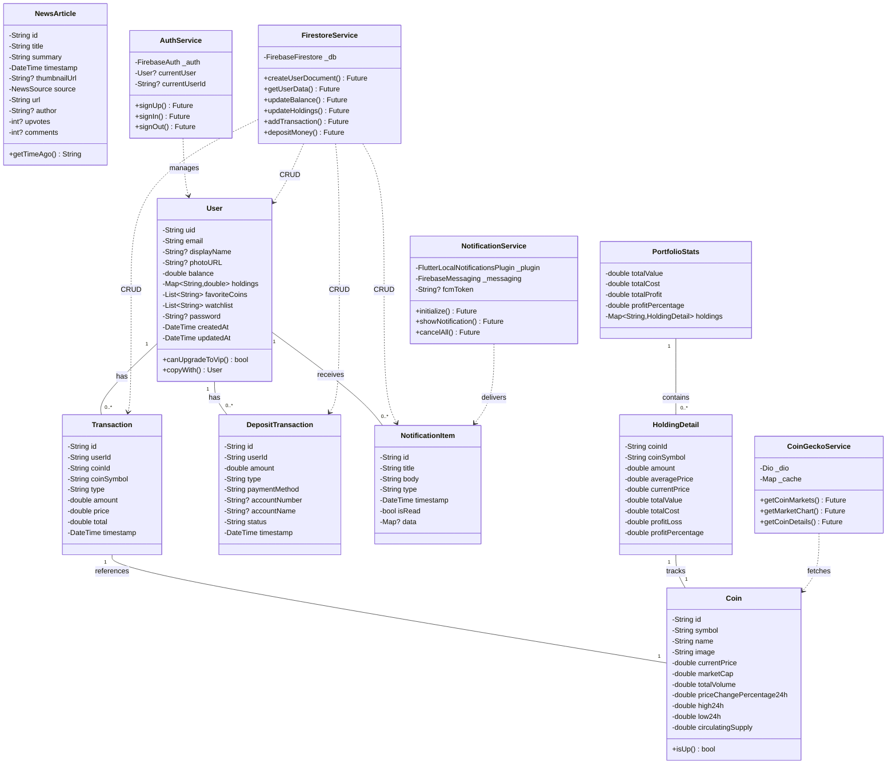
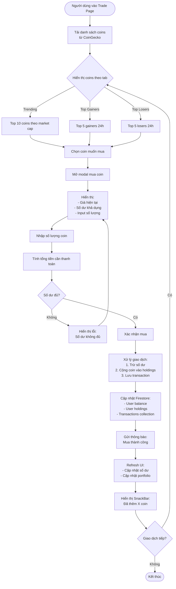
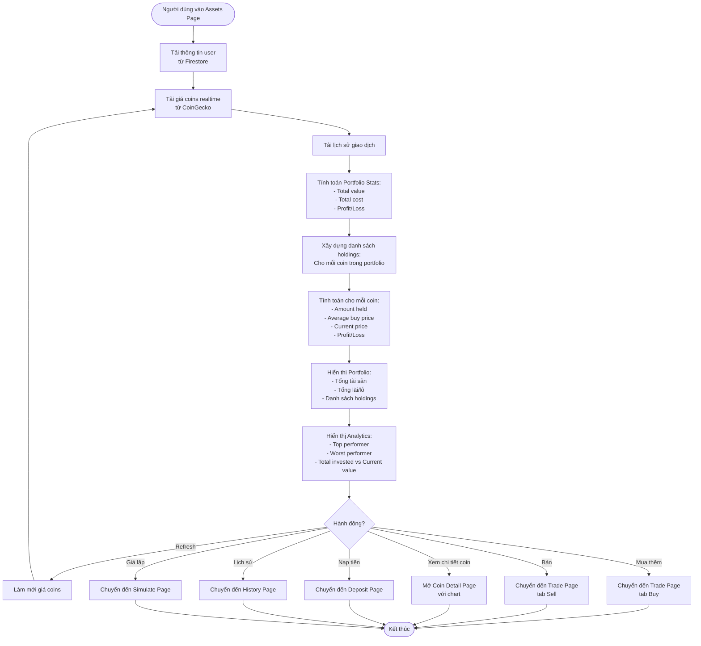
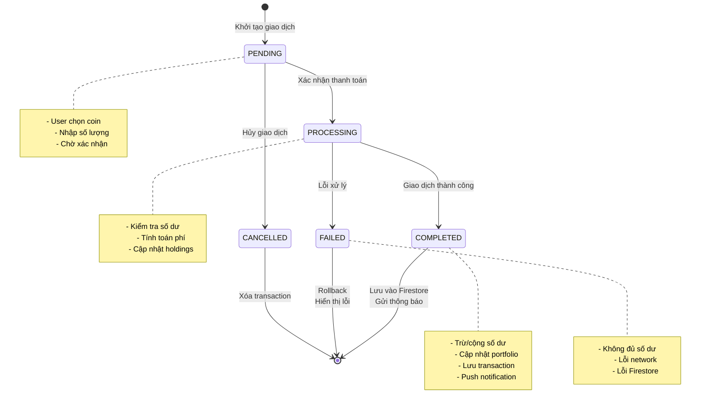
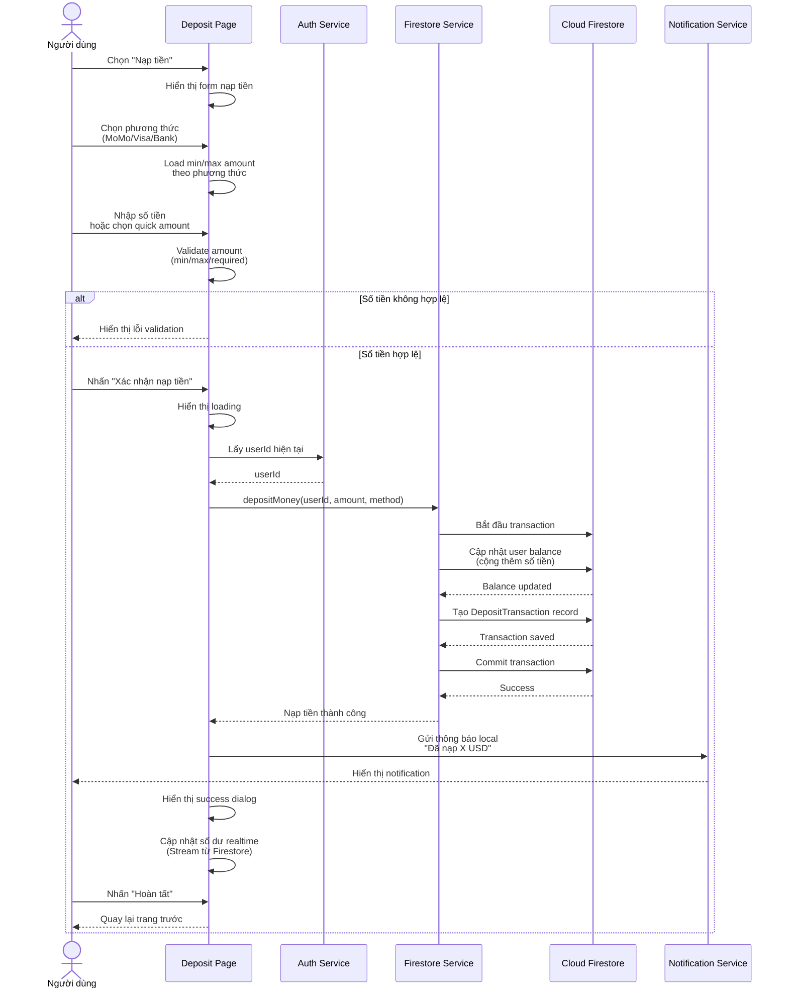
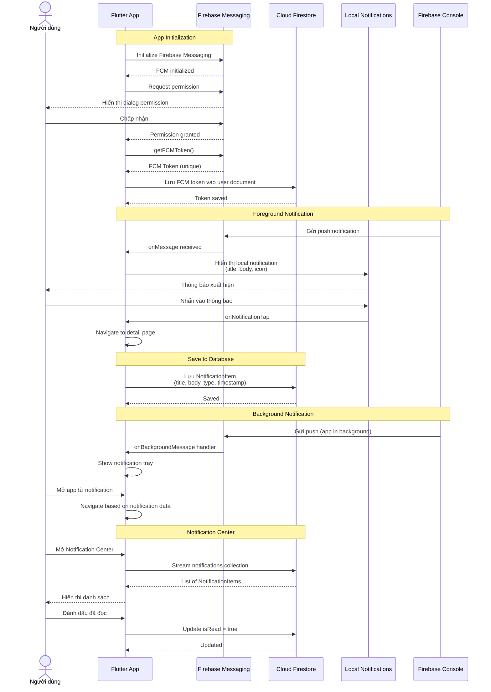

# LAPTRINHMOBILE_N06_K17_NHOM15 — Crypto Trading App
## 1. Giới thiệu

**Crypto Trading App** là một ứng dụng mobile cross-platform được xây dựng bằng Flutter, cung cấp nền tảng giao dịch và theo dõi cryptocurrency theo thời gian thực. Ứng dụng tích hợp API CoinGecko để cung cấp dữ liệu thị trường chính xác, hỗ trợ giao dịch mô phỏng, quản lý danh mục đầu tư, theo dõi tin tức crypto, và hệ thống thông báo push với Firebase Cloud Messaging.

**Mục tiêu:** Cung cấp một nền tảng trading thân thiện, giúp người dùng:
- Theo dõi thị trường crypto realtime
- Thực hiện giao dịch mô phỏng an toàn
- Quản lý portfolio đầu tư hiệu quả
- Nhận thông báo về biến động giá và tin tức

---

## 2. Thành viên nhóm

| Họ tên              | MSSV      | Vai trò/Nhiệm vụ chính                                                 |
|---------------------|-----------|------------------------------------------------------------------------|
| Chu Thành Tân | 23010165  | Project Lead, Architecture, Firebase Integration, Authentication, UI/UX Design, Market Page, Charts, News Integration |
| Nguyễn Duy Bảo | 23017133   | Báo cáo, Slide |
| GVHD: Nguyễn Văn Cường  | | Hướng dẫn, phản biện |

---

## 3. Công nghệ sử dụng

- **Framework:** Flutter 3.x (Dart 3.x)
- **State Management:** Provider
- **Backend:** Firebase (Authentication, Firestore, Cloud Messaging)
- **API:** CoinGecko API, Reddit API
- **Database:** Cloud Firestore
- **Authentication:** Firebase Auth (Email/Password)
- **Push Notifications:** Firebase Cloud Messaging (FCM)
- **Charts:** fl_chart
- **HTTP Client:** dio, http
- **Caching:** In-memory cache with TTL
- **Image Loading:** cached_network_image
- **Utilities:** intl, provider, url_launcher, shared_preferences

---

## 4. Chức năng chính đã xây dựng

### 4.1. Hệ thống xác thực & bảo mật
- Đăng ký/Đăng nhập với Email & Password
-  Firebase Authentication
-  Session persistence
-  Logout an toàn

### 4.2. Dashboard & Home
-  Hiển thị số dư tài khoản
-  Danh sách top coins theo market cap
-  Lọc theo trending/gainers/losers
-  Tìm kiếm coin nhanh
-  Quick actions: Nạp/Rút/Mua/Bán
-  Portfolio summary (tổng tài sản, lãi/lỗ)
-  Notification center với badge

### 4.3. Market (Thị trường)
-  Danh sách 100+ coins realtime từ CoinGecko
-  Thông tin chi tiết: giá, volume, market cap, thay đổi 24h
-  Tabs: Tất cả / Yêu thích / Top Gainers / Top Losers
-  Thêm/xóa yêu thích
-  Tìm kiếm coin theo tên/symbol
-  Thống kê tổng quan thị trường
-  Pull-to-refresh
-  Cache tự động (5 phút)

### 4.4. Trading (Giao dịch)
-  Giao diện POS hiện đại
-  Trending coins, Top gainers/losers
-  Mua/Bán coin trực quan
-  Hiển thị số dư khả dụng
-  Tính toán tự động số lượng coin
-  Xác nhận giao dịch
-  Cập nhật portfolio realtime
-  Thông báo giao dịch thành công/thất bại

### 4.5. Portfolio (Tài sản)
-  Tổng quan danh mục đầu tư
-  Tổng giá trị tài sản realtime
-  Lãi/lỗ tổng thể ($ và %)
-  Chi tiết từng coin đang nắm giữ
- Tính toán:
  - Số lượng đang có
  - Giá mua trung bình
  - Giá hiện tại
  - Lãi/lỗ cho từng coin
- Portfolio Analytics:
  - Top performer
  - Worst performer
  - Tổng đầu tư vs Giá trị hiện tại
- Quick demo actions (Beginner/Intermediate/Advanced/Whale portfolios)
-  Nút nhanh: Nạp tiền, Lịch sử, Giả lập số dư
-  Làm mới giá realtime

### 4.6. News (Tin tức)
-  Tích hợp Reddit r/CryptoCurrency
-  Tích hợp CoinGecko News
-  Hiển thị tiêu đề, tóm tắt, upvotes, comments
-  Lọc theo nguồn: Reddit / CoinGecko / Tất cả
-  Sắp xếp theo thời gian
-  Chi tiết bài viết
-  Mở link trong browser
-  Chia sẻ bài viết
-  Cache 5 phút

### 4.7. Wallet (Ví tiền)
-  Hiển thị số dư tài khoản
- Nạp tiền (Deposit):
  - Chọn phương thức: MoMo / Visa/Mastercard / Bank Transfer
  - Chọn số tiền nhanh (100, 500, 1K, 2K, 5K, 10K)
  - Mô phỏng thanh toán
  - Lưu transaction vào Firestore
- Rút tiền (Withdraw):
  - Chọn phương thức: Bank Transfer / MoMo / Visa
  - Nhập thông tin tài khoản
  - Tính phí tự động
  - Xác nhận rút tiền
- Lịch sử giao dịch nạp/rút
- Bảo mật thông tin

### 4.8. History (Lịch sử)
- Danh sách tất cả giao dịch (buy/sell/deposit/withdraw)
- Hiển thị thông tin chi tiết:
  - Loại giao dịch (icon & màu riêng biệt)
  - Số lượng coin/số tiền
  - Giá tại thời điểm giao dịch
  - Thời gian
  - Trạng thái
- Sắp xếp theo thời gian mới nhất
- Kết hợp cả crypto transactions và deposit/withdraw

### 4.9. Coin Detail
-  Biểu đồ giá (1D/7D/30D/1Y) với fl_chart
-  Thông tin chi tiết: Market Cap, Volume, High/Low 24h
-  Mua/Bán nhanh từ trang chi tiết
-  Hiển thị số lượng đang nắm giữ
-  Advanced Trading (Stop Loss, Take Profit) - Chưa kích hoạt

### 4.10. Notifications (Thông báo)
-  Firebase Cloud Messaging (FCM)
-  Local Notifications
- Notification Center:
  - Hiển thị tất cả thông báo
  - Lọc theo loại (trade/price_alert/volatility/news)
  - Đánh dấu đã đọc
  - Xóa thông báo
- Các loại thông báo:
  - 💰 Giao dịch mua/bán thành công
  - 🎯 Cảnh báo giá tăng/giảm
  - 🚀 Biến động mạnh
  - 💸 Nhận coin
  - 📰 Tin tức thị trường
  - 🛑 Stop Loss kích hoạt
  - 🎉 Take Profit kích hoạt
- Badge số lượng thông báo chưa đọc
- Notification Settings (bật/tắt từng loại)

### 4.11. Settings & Demo Tools
- **Giả lập số dư (Simulate Balance):**
  - Điều chỉnh số dư tùy ý
  - Thêm coin vào portfolio
  - Demo portfolios nhanh (Beginner/Intermediate/Advanced/Whale)
  - Reset tất cả về 0
- **Quick Demo Actions:**
  - Thiết lập portfolio theo mức độ (1K-1M)
  - Tự động phân bổ coin theo market cap
  - Tính toán theo giá thực tế
- **Cài đặt thông báo:**
  - Bật/tắt từng loại thông báo
  - Quản lý FCM token
- **Demo Push Notification:**
  - Test các loại thông báo local
  - Hiển thị FCM token để test từ Firebase Console
- **Debug & Cache:**
  - Kiểm tra trạng thái API
  - Xem thông tin cache
  - Xóa cache thủ công
- Quản lý thiết bị
- Đăng xuất

### 4.12. Tính năng kỹ thuật
- **Cache thông minh:**
  - Tự động cache API calls (5 phút TTL)
  - Fallback khi rate limit
  - Retry với exponential backoff
- **Realtime updates:**
  - Stream dữ liệu từ Firestore
  - Auto-refresh portfolio
  - Live balance updates
- **Error Handling:**
  - Hiển thị lỗi thân thiện
  - Snackbar notifications
  - Loading states
- **Performance:**
  - Image caching
  - Lazy loading
  - Optimized queries
- **Responsive UI:**
  - Adaptive layouts
  - Material Design 3
  - Dark/Light themes (partial)

---

## 5. Cấu trúc thư mục Project

```
project_cuoi_ki/
├── .dart_tool/
├── .idea/
├── .vscode/
├── android/
├── build/
├── lib/
│   ├── main.dart                      # Entry point, Firebase init, navigation
│   ├── auth/
│   │   └── login_page.dart           # Đăng nhập/Đăng ký
│   ├── models/
│   │   ├── coin.dart                  # Model cryptocurrency
│   │   ├── user_model.dart            # Model người dùng
│   │   ├── transaction.dart           # Model giao dịch crypto
│   │   ├── deposit_transaction.dart   # Model giao dịch nạp/rút
│   │   ├── news_article.dart          # Model tin tức
│   │   ├── notification_item.dart     # Model thông báo
│   │   ├── notification_settings.dart # Model cài đặt thông báo
│   │   ├── portfolio_stats.dart       # Model thống kê portfolio
│   │   └── price_alert.dart           # Model cảnh báo giá
│   ├── pages/
│   │   ├── home_page.dart             # Trang chủ/Dashboard
│   │   ├── market_page.dart           # Thị trường crypto
│   │   ├── trade_page.dart            # Giao dịch/POS
│   │   ├── assets_page.dart           # Danh mục đầu tư
│   │   ├── news_page.dart             # Tin tức crypto
│   │   ├── news_detail_page.dart      # Chi tiết bài viết
│   │   ├── coin_detail_page.dart      # Chi tiết coin + chart
│   │   ├── wallet_page.dart           # Ví tiền (nạp/rút)
│   │   ├── deposit_page.dart          # Nạp tiền
│   │   ├── withdraw_page.dart         # Rút tiền
│   │   ├── history_page.dart          # Lịch sử giao dịch
│   │   ├── notification_center_page.dart # Trung tâm thông báo
│   │   ├── notification_demo_page.dart   # Demo thông báo
│   │   ├── simulate_balance_page.dart    # Giả lập số dư
│   │   ├── debug_page.dart            # Debug & Cache info
│   │   ├── news_test_page.dart        # Test news API
│   │   └── main_navigation_page.dart  # Bottom navigation
│   ├── services/
│   │   ├── auth_service.dart          # Firebase Authentication
│   │   ├── firestore_service.dart     # Firestore CRUD operations
│   │   ├── coingecko_service.dart     # CoinGecko API wrapper
│   │   ├── news_service.dart          # Reddit + CoinGecko news
│   │   ├── notification_service.dart  # FCM + Local notifications
│   │   ├── portfolio_service.dart     # Portfolio calculations
│   │   ├── alert_service.dart         # Price alerts
│   │   └── fallback_data.dart         # Deprecated hardcode data
│   ├── settings/
│   │   ├── settings_page.dart         # Trang cài đặt
│   │   ├── notification_settings_page.dart # Cài đặt thông báo
│   │   ├── device_management_page.dart     # Quản lý thiết bị
│   │   └── otp_setup_page.dart        # Thiết lập OTP (demo)
│   └── widgets/
│       └── quick_demo_actions.dart    # Widget demo portfolios
├── test/
│   └── widget_test.dart               # Unit tests
├── .gitignore
├── .metadata
├── analysis_options.yaml
├── pubspec.yaml                        # Dependencies
├── pubspec.lock
└── README.md  
```

---

## 6. Mô tả chi tiết các đối tượng và chức năng

### 6.1. User (Người dùng)
- **Thuộc tính:** uid, email, displayName, photoURL, balance, holdings, favoriteCoins, watchlist, password (encrypted), createdAt, updatedAt
- **Chức năng:**
  - Đăng ký/đăng nhập
  - Quản lý số dư
  - Quản lý danh mục coin
  - Lưu danh sách yêu thích

### 6.2. Coin (Cryptocurrency)
- **Thuộc tính:** id, symbol, name, image, currentPrice, marketCap, totalVolume, priceChangePercentage24h, high24h, low24h, circulatingSupply
- **Nguồn:** CoinGecko API (realtime)
- **Chức năng:**
  - Hiển thị thông tin thị trường
  - Lọc theo market cap/volume/giá
  - Tính toán lãi/lỗ trong portfolio

### 6.3. Transaction (Giao dịch Crypto)
- **Thuộc tính:** id, userId, coinId, coinSymbol, type (buy/sell), amount, price, total, timestamp
- **Chức năng:**
  - Lưu lịch sử mua/bán
  - Tính toán portfolio stats
  - Hiển thị trong history

### 6.4. DepositTransaction (Giao dịch Nạp/Rút)
- **Thuộc tính:** id, userId, amount, type (deposit/withdraw), paymentMethod, accountNumber, accountName, status, timestamp
- **Chức năng:**
  - Lưu lịch sử nạp/rút tiền
  - Quản lý phương thức thanh toán
  - Tính phí giao dịch

### 6.5. NewsArticle (Tin tức)
- **Thuộc tính:** id, title, summary, timestamp, thumbnailUrl, source (reddit/coinGecko), url, author, upvotes, comments
- **Nguồn:** Reddit API + CoinGecko News
- **Chức năng:**
  - Hiển thị tin tức crypto
  - Lọc theo nguồn
  - Mở link bài viết

### 6.6. NotificationItem (Thông báo)
- **Thuộc tính:** id, title, body, type (trade/price_alert/volatility/news), timestamp, isRead, data
- **Chức năng:**
  - Lưu thông báo vào Firestore
  - Hiển thị trong Notification Center
  - Đánh dấu đã đọc/xóa

### 6.7. PortfolioStats (Thống kê Portfolio)
- **Thuộc tính:** totalValue, totalCost, totalProfit, profitPercentage, holdings (Map<coinId, HoldingDetail>)
- **HoldingDetail:** coinId, coinSymbol, amount, averagePrice, currentPrice, totalValue, totalCost, profitLoss, profitPercentage
- **Chức năng:**
  - Tính toán tổng tài sản
  - Tính lãi/lỗ cho từng coin
  - Xác định top/worst performers

---

## 7. Diagram

### 7.1. Class Diagram



### 7.2. Activity Diagram - Quy trình mua coin



### 7.3. Activity Diagram - Quản lý Portfolio



### 7.4. State Diagram - Vòng đời giao dịch



### 7.5. Sequence Diagram - Quy trình nạp tiền



### 7.6. Sequence Diagram - Push Notification Flow



---

## 8. Hướng dẫn sử dụng

### 8.1. Cài đặt & chạy dự án

**Yêu cầu:**
- Flutter SDK 3.x+
- Dart 3.x+
- Android Studio / VS Code
- Firebase project đã setup
- CoinGecko API (free tier)

**Các bước:**

1. **Clone repository:**
```sh
git clone https://github.com/tanbentam/LAPTRINHMOBILE_N06_K17_NHOM15
cd LAPTRINHMOBILE_N06_K17_NHOM15
```

2. **Cài đặt dependencies:**
```sh
flutter pub get
```

3. **Cấu hình Firebase:**
- Tạo Firebase project tại [console.firebase.google.com](https://console.firebase.google.com)
- Enable Authentication (Email/Password)
- Enable Firestore Database
- Enable Cloud Messaging
- Download `google-services.json` (Android) và đặt vào app

4. **Cấu hình Firebase trong code:**
- Kiểm tra `main.dart` đã có `Firebase.initializeApp()`
- Kiểm tra `FirestoreService` đã connect đúng

5. **Chạy app (hiện tại App vẫn chỉ được phát triển và thử nghiệm trên Android):**
```sh
# Android
flutter run
```

### 8.2. Tài khoản demo

Đăng ký tài khoản mới hoặc sử dụng email bất kỳ:
- Email: `demo@crypto.com`
- Password: `password123`

Tài khoản mới sẽ có:
- Balance: $1,000 (default)
- Holdings: trống
- Có thể thay đổi tại Simulate Balance Page

### 8.3. Sử dụng các chức năng chính

#### Đăng nhập
1. Mở app → Trang `login_page.dart`
2. Nhập email/password hoặc đăng ký mới
3. Hệ thống tự động lưu session
4. Điều hướng đến Home Page

#### Xem thị trường
1. Vào tab **Market**
2. Xem danh sách 100+ coins realtime
3. Chọn tab: Tất cả / Yêu thích / Top Gainers / Top Losers
4. Tìm kiếm coin theo tên
5. Click vào coin → Xem chi tiết + chart

#### Mua/Bán coin
1. Vào tab **Trade**
2. Chọn coin từ Trending/Gainers/Losers
3. Click icon giỏ hàng (mua) hoặc icon bán
4. Nhập số lượng coin
5. Xác nhận → Giao dịch hoàn tất
6. Nhận thông báo

#### Quản lý Portfolio
1. Vào tab **Assets**
2. Xem tổng tài sản, lãi/lỗ
3. Click vào từng coin để xem chi tiết
4. Làm mới giá: Click icon refresh
5. Nạp tiền: Click icon wallet → Deposit
6. Giả lập số dư: Click icon tune → Simulate Balance

#### Nạp/Rút tiền
1. Vào **Assets** → Click icon wallet
2. Chọn Nạp/Rút tiền
3. Chọn phương thức thanh toán
4. Nhập số tiền
5. Xác nhận → Hoàn tất

#### Xem tin tức
1. Vào tab **News**
2. Lọc theo Reddit / CoinGecko
3. Click vào bài viết → Xem chi tiết
4. Click "Đọc bài viết đầy đủ" → Mở browser

#### Quản lý thông báo
1. Vào Home → Click icon chuông
2. Xem tất cả thông báo
3. Lọc theo loại (trade/price alert/news)
4. Đánh dấu đã đọc hoặc xóa

#### Giả lập Portfolio (Demo)
1. Vào **Assets** → Click icon tune
2. Hoặc **Settings** → Giả lập số dư
3. Chọn portfolio demo (Beginner/Intermediate/Advanced/Whale)
4. Hoặc tùy chỉnh số dư và thêm coin thủ công
5. Click "Áp dụng" → Portfolio được thiết lập tự động theo giá thực tế

---

## 9. API Endpoints

### 9.1. Firebase Authentication
- `POST /signUp` — Đăng ký tài khoản
- `POST /signIn` — Đăng nhập
- `POST /signOut` — Đăng xuất
- `POST /resetPassword` — Đặt lại mật khẩu

### 9.2. Firestore Collections

**users:**
```json
{
  "uid": "string",
  "email": "string",
  "displayName": "string",
  "balance": "number",
  "holdings": {
    "bitcoin": 0.5,
    "ethereum": 2.3
  },
  "favoriteCoins": ["bitcoin", "ethereum"],
  "watchlist": ["cardano"],
  "fcmToken": "string",
  "createdAt": "timestamp",
  "updatedAt": "timestamp"
}
```

**transactions:**
```json
{
  "id": "string",
  "userId": "string",
  "coinId": "bitcoin",
  "coinSymbol": "BTC",
  "type": "buy|sell",
  "amount": 0.5,
  "price": 50000,
  "total": 25000,
  "timestamp": "timestamp"
}
```

**deposit_transactions:**
```json
{
  "id": "string",
  "userId": "string",
  "amount": 1000,
  "type": "deposit|withdraw",
  "paymentMethod": "momo|visa|bank_transfer",
  "accountNumber": "string",
  "accountName": "string",
  "status": "completed",
  "timestamp": "timestamp"
}
```

**notifications:**
```json
{
  "id": "string",
  "userId": "string",
  "title": "string",
  "body": "string",
  "type": "trade|price_alert|volatility|news",
  "isRead": false,
  "timestamp": "timestamp",
  "data": {}
}
```

**notification_settings:**
```json
{
  "userId": "string",
  "tradeNotifications": true,
  "priceAlerts": true,
  "volatilityAlerts": true,
  "newsNotifications": true
}
```

### 9.3. CoinGecko API

**Base URL:** `https://api.coingecko.com/api/v3`

- `GET /coins/markets` — Danh sách coins
  - Params: `vs_currency=usd&order=market_cap_desc&per_page=100&page=1&sparkline=false`
  - Cache: 5 phút
  
- `GET /coins/{id}/market_chart` — Dữ liệu chart
  - Params: `vs_currency=usd&days=7&interval=daily`
  - Cache: 5 phút

- `GET /coins/{id}` — Chi tiết coin
  - Params: `localization=false&tickers=false&market_data=true`
  - Cache: 5 phút

### 9.4. Reddit API

**Base URL:** `https://www.reddit.com`

- `GET /r/CryptoCurrency/hot.json` — Tin tức hot
  - Params: `limit=25`
  - Cache: 5 phút

---

## 10. Cấu trúc Database (Firestore)

### 10.1. Collections

```
users/
├── {userId}/
│   ├── uid: string
│   ├── email: string
│   ├── displayName: string
│   ├── balance: number
│   ├── holdings: map
│   ├── favoriteCoins: array
│   ├── watchlist: array
│   ├── fcmToken: string
│   ├── createdAt: timestamp
│   └── updatedAt: timestamp

transactions/
├── {transactionId}/
│   ├── id: string
│   ├── userId: string
│   ├── coinId: string
│   ├── coinSymbol: string
│   ├── type: string (buy/sell)
│   ├── amount: number
│   ├── price: number
│   ├── total: number
│   └── timestamp: timestamp

deposit_transactions/
├── {transactionId}/
│   ├── id: string
│   ├── userId: string
│   ├── amount: number
│   ├── type: string (deposit/withdraw)
│   ├── paymentMethod: string
│   ├── accountNumber: string
│   ├── accountName: string
│   ├── status: string
│   └── timestamp: timestamp

notifications/
├── {notificationId}/
│   ├── id: string
│   ├── userId: string
│   ├── title: string
│   ├── body: string
│   ├── type: string
│   ├── isRead: boolean
│   ├── timestamp: timestamp
│   └── data: map

notification_settings/
├── {userId}/
│   ├── tradeNotifications: boolean
│   ├── priceAlerts: boolean
│   ├── volatilityAlerts: boolean
│   └── newsNotifications: boolean
```

### 10.2. Indexes

Recommended indexes for performance:
- `transactions`: (userId, timestamp DESC)
- `deposit_transactions`: (userId, timestamp DESC)
- `notifications`: (userId, isRead, timestamp DESC)

### 10.3. Security Rules

```javascript
rules_version = '2';
service cloud.firestore {
  match /databases/{database}/documents {
    // Users
    match /users/{userId} {
      allow read, write: if request.auth != null && request.auth.uid == userId;
    }
    
    // Transactions
    match /transactions/{transactionId} {
      allow read: if request.auth != null && resource.data.userId == request.auth.uid;
      allow create: if request.auth != null && request.resource.data.userId == request.auth.uid;
    }
    
    // Deposit Transactions
    match /deposit_transactions/{transactionId} {
      allow read: if request.auth != null && resource.data.userId == request.auth.uid;
      allow create: if request.auth != null && request.resource.data.userId == request.auth.uid;
    }
    
    // Notifications
    match /notifications/{notificationId} {
      allow read, update: if request.auth != null && resource.data.userId == request.auth.uid;
      allow create: if request.auth != null;
    }
    
    // Notification Settings
    match /notification_settings/{userId} {
      allow read, write: if request.auth != null && request.auth.uid == userId;
    }
  }
}
```

---

## 11. Kiểm thử

### 11.1. Unit Tests

Chạy tests:
```sh
flutter test
```

### 11.2. Test Coverage

Các module đã test:
- Model validation (User, Coin, Transaction)
- Service logic (CoinGeckoService caching)
- Portfolio calculations (PortfolioService)
- ⚠️ Widget tests (partial)

### 11.3. Test Cases chính

**Authentication:**
- Đăng ký với email hợp lệ
- Đăng nhập với thông tin đúng
- Xử lý lỗi đăng nhập sai
- Logout và clear session

**Trading:**
- Mua coin với số dư đủ
- Bán coin với số lượng đủ
- Xử lý lỗi số dư không đủ
- Cập nhật holdings chính xác

**Portfolio:**
- Tính toán lãi/lỗ chính xác
- Hiển thị top/worst performers
- Cập nhật realtime khi có giao dịch
- Refresh giá từ API

**Notifications:**
- Gửi thông báo local
- Lưu vào Firestore
- Đánh dấu đã đọc
- Xóa thông báo
- Lọc theo type

**API Integration:**
- Fetch coins từ CoinGecko
- Cache 5 phút hoạt động
- Retry khi rate limit (429)
- Fallback khi offline

---

## 12. Tính năng nâng cao (có thể mở rộng)

### 12.1. Đã triển khai
- Realtime price updates với Stream
- Push notifications (FCM)
- Local notifications
- Cache thông minh với TTL
- Retry mechanism cho API
- Portfolio analytics
- Demo portfolios tự động

### 12.2. Có thể mở rộng
- 📊 Advanced charts (candlestick, indicators)
- 🤖 Trading bot automation
- 📈 AI price prediction
- 💱 Multi-currency support (VND, EUR)
- 🔔 Price alerts với customizable thresholds
- 📱 Widgets cho iOS/Android home screen
- 🌙 Dark mode hoàn chỉnh
- 🔐 Biometric authentication (fingerprint/FaceID)
- 💳 Real payment gateway integration
- 🌐 Multi-language (i18n)
- 📊 Export portfolio to PDF/Excel
- 🎓 Educational content (crypto learning)
- 👥 Social features (copy trading, leaderboard)
- 🔄 DCA (Dollar Cost Averaging) strategy
- 📅 Scheduled recurring buys

---

## 13. Performance & Optimization

### 13.1. Đã optimize
- Image caching với `cached_network_image`
- API caching (5 phút TTL)
- Lazy loading danh sách coins
- Stream subscriptions được dispose đúng cách
- Minimized Firestore reads
- Indexed queries

### 13.2. Best Practices
- Use `const` constructors where possible
- Dispose controllers properly
- Avoid unnecessary rebuilds
- Use `AutomaticKeepAliveClientMixin` cho tabs
- Optimize images (compress before upload)

---

## 14. Troubleshooting

### 14.1. Lỗi thường gặp

**1. Firebase not initialized:**
```dart
// Solution: Ensure Firebase.initializeApp() trong main()
await Firebase.initializeApp();
```

**2. CoinGecko rate limit (429):**
```dart
// Solution: App tự động cache và retry
// Hoặc xóa cache: Settings > Debug > Clear Cache
```

**3. Notification không hiện:**
```dart
// Check: Permission đã được cấp chưa?
// Check: FCM token đã lưu vào Firestore?
// Test: Dùng Notification Demo Page
```

**4. Holdings không cập nhật:**
```dart
// Solution: Kiểm tra Firestore rules
// Ensure user có quyền write vào users/{uid}
```

### 14.2. Debug Tools

Sử dụng `debug_page.dart`:
- Kiểm tra trạng thái API
- Xem cache info
- Clear cache thủ công
- Test API connectivity

---

## 15. Deployment

### 15.1. Android Build

```sh
# Debug APK
flutter build apk --debug

# Release APK
flutter build apk --release

# App Bundle (for Play Store)
flutter build appbundle --release
```


### 15.2. Firebase Deployment

1. **Firestore:**
   - Deploy indexes: `firebase deploy --only firestore:indexes`
   - Deploy rules: `firebase deploy --only firestore:rules`

2. **Cloud Functions (nếu có):**
   - Deploy: `firebase deploy --only functions`

3. **Hosting (web - nếu có):**
   - Build: `flutter build web`
   - Deploy: `firebase deploy --only hosting`

---

## 16. Tài liệu tham khảo

- [Flutter Documentation](https://docs.flutter.dev/)
- [Firebase Documentation](https://firebase.google.com/docs)
- [CoinGecko API](https://www.coingecko.com/en/api/documentation)
- [Provider State Management](https://pub.dev/packages/provider)
- [FL Chart](https://pub.dev/packages/fl_chart)
- [Firebase Messaging](https://firebase.flutter.dev/docs/messaging/overview/)

---

## 17. Changelog

### Version 1.0.0 (Current)
- Authentication với Firebase
- Market tracking với CoinGecko API
- Trading system (buy/sell)
- Portfolio management
- News integration (Reddit + CoinGecko)
- Wallet (deposit/withdraw)
- Transaction history
- Push notifications (FCM)
- Local notifications
- Notification center
- Demo portfolios
- Cache system
- Debug tools

### Upcoming (Roadmap)
- 🔄 Advanced trading (Stop Loss, Take Profit)
- 🔄 Price alerts customization
- 🔄 Dark mode
- 🔄 Biometric auth
- 🔄 Multi-language

---

## 18. Liên hệ & Hỗ trợ

- **Repository:** [GitHub Link](https://github.com/tanbentam/LAPTRINHMOBILE_N06_K17_NHOM15)
- **Issues:** [GitHub Issues](https://github.com/tanbentam/LAPTRINHMOBILE_N06_K17_NHOM15/issues)
- **Email:** chuthanhtan1995@gmail.com

---

## 19. Screenshots

### Home Page
!Home Page

### Market Page
!Market

### Trading
!Trading

### Portfolio
!Portfolio

### News
!News

---

## 20. License & Copyright

Dự án thuộc quyền sở hữu của nhóm phát triển, năm học 2025-2026.  
Chỉ sử dụng cho mục đích học tập và nghiên cứu.

---

## 21. Acknowledgments

Cảm ơn:
- **CoinGecko** cho API miễn phí
- **Firebase** cho backend services
- **Flutter team** cho framework tuyệt vời
- **Community contributors** cho các packages
- **Reddit** cho news API
- **Giảng viên hướng dẫn** cho sự support

---

**© 2025 Crypto Trading App Team. All rights reserved.**